

  

      <h5>Platform</h5>
      
<i>Desktop and Mobile Web</i>

  

  

      <h5>Country</h5>
      
<i>Singapore, Philippines, Hong Kong</i>

  

  

      <h5>Duration</h5>
      
<i>6 months</i>

  

---

Carousell is the biggest classifieds marketplace in Southeast Asia as of 2020, with 20+ million users across 7 major markets.

On Carousell, you can buy anything, from books, shoes, electronics to cars. But Cars and Property are the highest value categories, and their journeys are very different. So we decided to improve the experience to map better for that journey. For complex journeys, it helps to deep dive and comprehends the task better.

### My role
I led the design of the new web experience and collaborated with two other designers and a PM.

In addition, I worked closely with 5 engineers, clarified, discussed, and reviewed their PRs (Pull Request) to smoothen the development process.

The landing page launched in September 2020. The new listing detail is still in development. 

## Inheriting Legacy 
Not like other startups during the early days, Carousell started with mobile applications, iOS, and Android. Web, on the other hand, was treated and positioned as a secondary product. Most features were designed and built for mobile-first and later integrated into the web.

Cars and Property shoppers tend to do more of their browsing, research, buying on the web due to the large amount of information they need to consider.

So start of the 2020, we decided to focus more on the web, to build a better experience for web shoppers.

###### About the audience and market
## A closer understanding of Singapore car & home buyers
Singapore is physically small. This means that the number of cars and property allowed has to be properly controlled, so it’s very expensive.

From our user research, we learned that car and home buyers spend around 3 to 4 months on average researching online. Some even take up to one year to make a decision.

  

    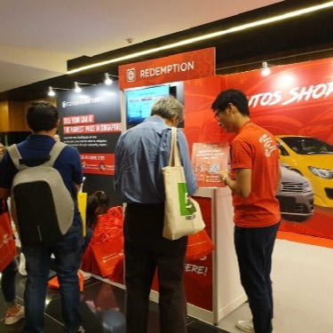
  

  

    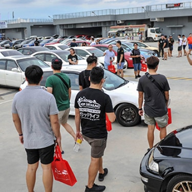
  

They usually have some specific criteria in mind. For car buyers, start with a budget, make/offer, and registration year. For home buyers, they start with neighborhood, types, and budget. In a nutshell, they are power searchers and detail-driven.

### But not only for Singapore
Singapore is not the only market for cars and property. We want to build a better experience for people in the Philippines, Hong Kong, and other countries in Southeast Asia.

###### The process
## Problems, challenges, ideas & iterations

### Problems

#### Search / Browse

Carousell was first built for secondhand goods (Mobile, electronic, fashion,…). Day by day, more categories were added, including high-value categories like Cars and Property. But Car and Property users are are power searchers and detail-driven, the general search isn’t good enough for them. The search result is usually not relevant.

But search shouldn’t be the only way for buying cars and property. We want a way to inspire them with editorial content and recommendations.

  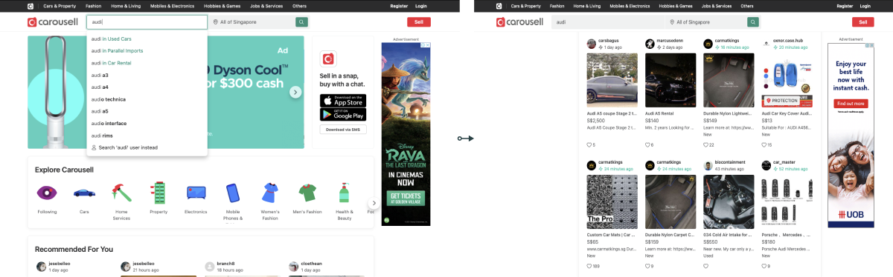
  <figcaption>Current flow for Cars and Property: Purely search, and search result is usually unrelevant</figcaption>

#### Listing detail
There are many problems with our current listing detail page. For high-value items like cars and property, we need to show more information to buyers, the page was getting worse and less trustworthy.

  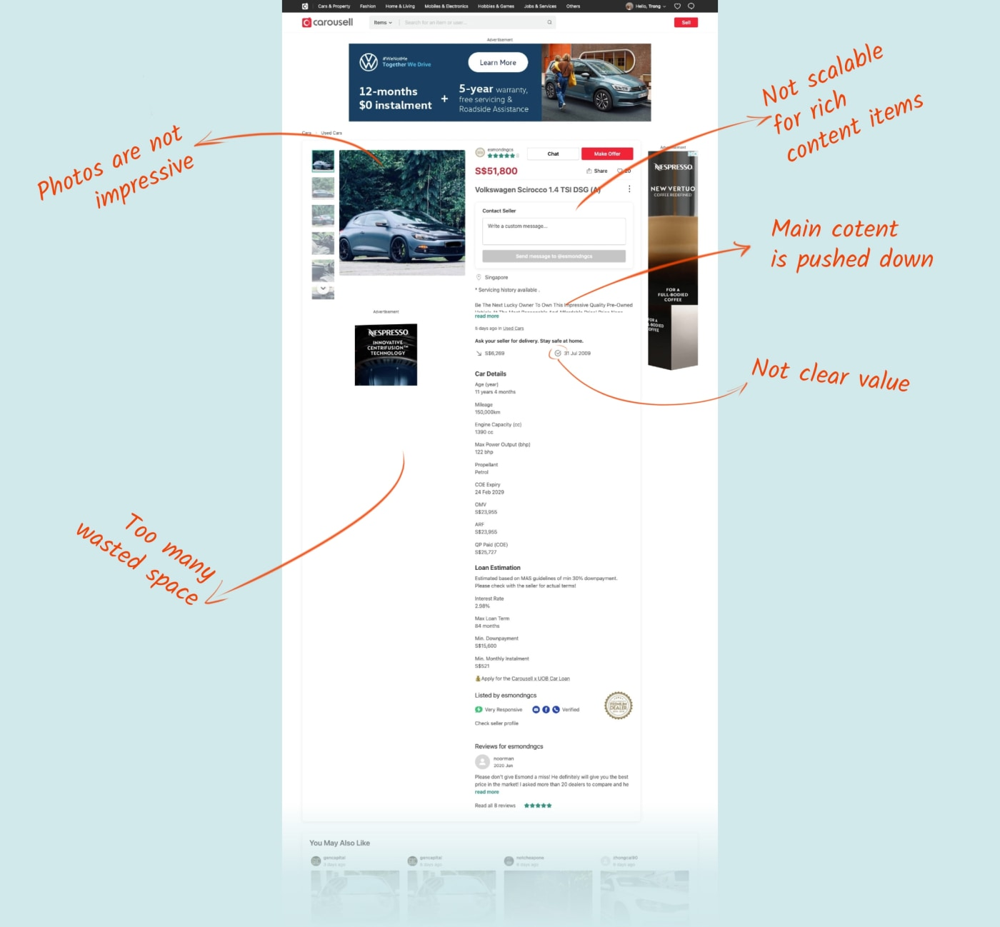
  <figcaption>The old (current) listing detail page.</figcaption>

Problems with the current design:
- People are not converted or low conversion rate (Chat and sign up)
- Many wasted spaces and bad UI elements
- Difficult to add new information for high-value items like Property & Cars.
- External Ads annoy people.

### The challenge
High-level challenges:

- How to make a flexible homepage that works for both car and property, for different markets?
- How to improve cars and property experience but still stay unique with the whole Carousell?
- How to make a better listing detail page works across all categories but remain revenue from external ads?

### Ideas, iteration, and communication
At the early state of the project, I collaborated with two other designers, one designer from buyer experience, and another who is experienced in design for cars. Because we not only want to do the best for car and property but also make it work for the whole journey. From the time people come to Carousell, browse other categories, and come to our car/property categories.

With different perspectives, we came up with many different ideas. Some were different in layout, but some were different in direction. As the owner of the project, I had to find a way to harmonize different ideas from different people, but also convince them about what I believed is the best fit.

  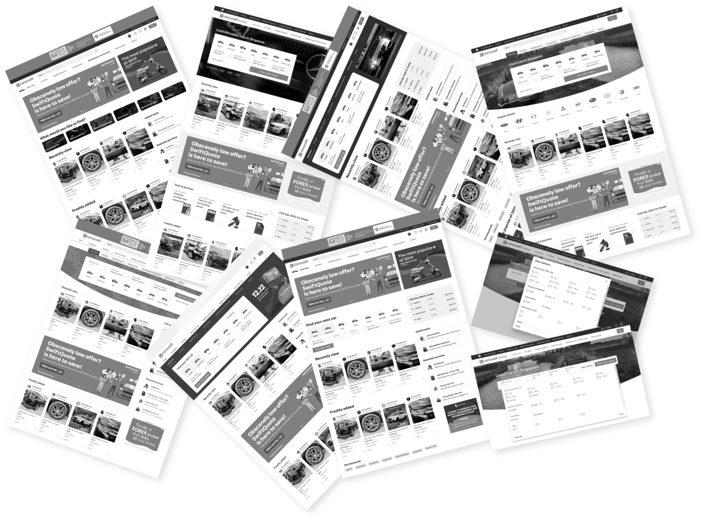

By having frequent syncs together every week, with open discussion and many iterate rounds, we worked much better together. Not only between designers, but we also did many meetings with PM, engineers, and stakeholders to get their feedback and alignment. The more we discuss, the clearer the direction and alignment.

From there, I dive into details.

---

###### The new web experience
## New home for Cars and Property

  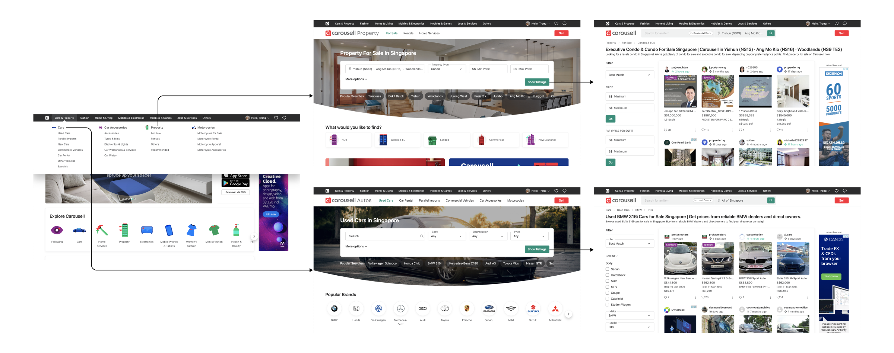

### Property

  <video autoplay loop muted playsinline src="./images/video-property-2.mp4"></video>

Property users are power searchers, they always have some criteria in mind when looking for a house to buy or to rent. Location is the most important, following are property type, budget, number of rooms,…

That’s why we put the filter as the hero of the page.

  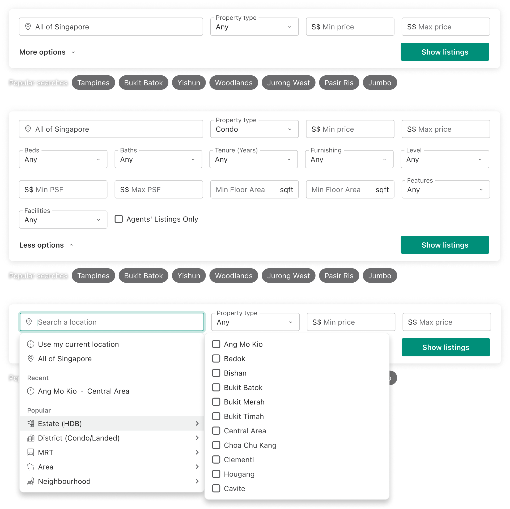
  <figcaption>Different states of property filter</figcaption>

But if they are not actively looking for a house, other sections on the page will help them to browse and inspire them with editorial content.

  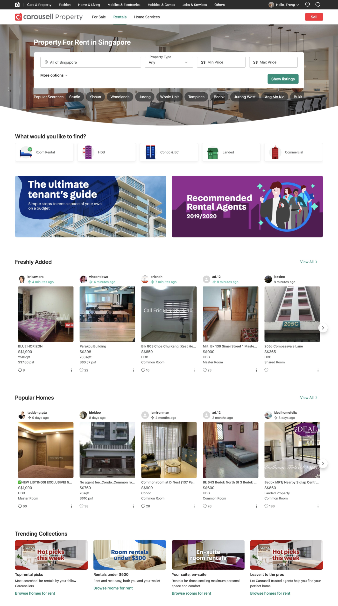
  <figcaption>Property for rent</figcaption>

### Cars
Similar to the property, when buying a used car, drivers usually have some criteria in mind (makes & models, body, budget,…)

  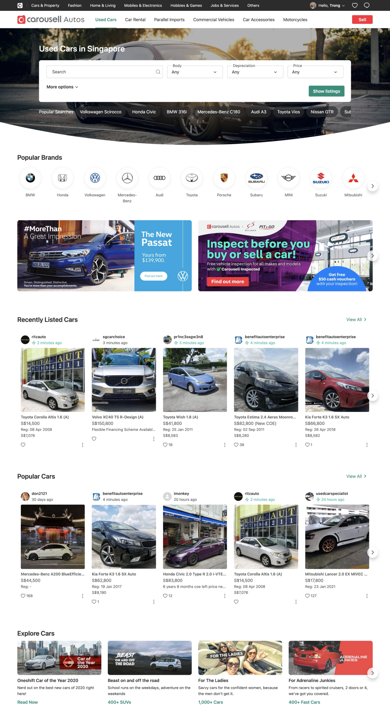

  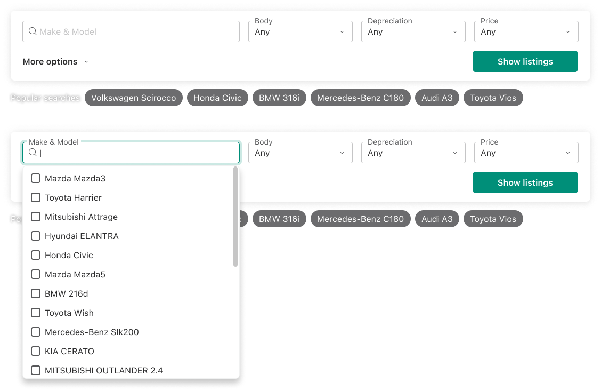
  <figcaption>Filters of Used Cars</figcaption>

### Other categories & other countries
Not only for cars and property, other related categories (motor, car accessories, workshop,…) also have their home base on that flexible template.

Carousell Cars/Property are not only for Singapore, we localized and launched it for the Philippines and Hong Kong.

  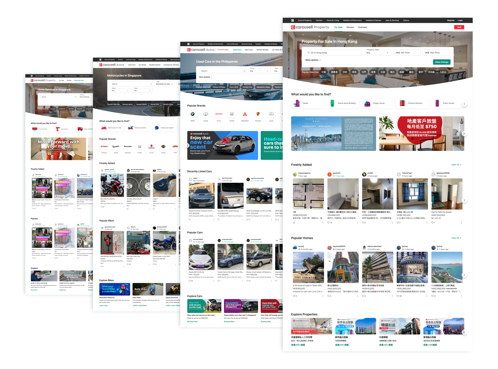
  <figcaption>Property, Cars, Motorbike and Home service landing pages for different countries</figcaption>

### Global navigation
People will look at Carousell as one. They don’t care how many different categories we have. So besides new landing pages for Cars and Property, we pushed more effort to rebuild the whole global navigation.

We wanted to build a website that people navigate between different pages/categories smoothly. 

  

    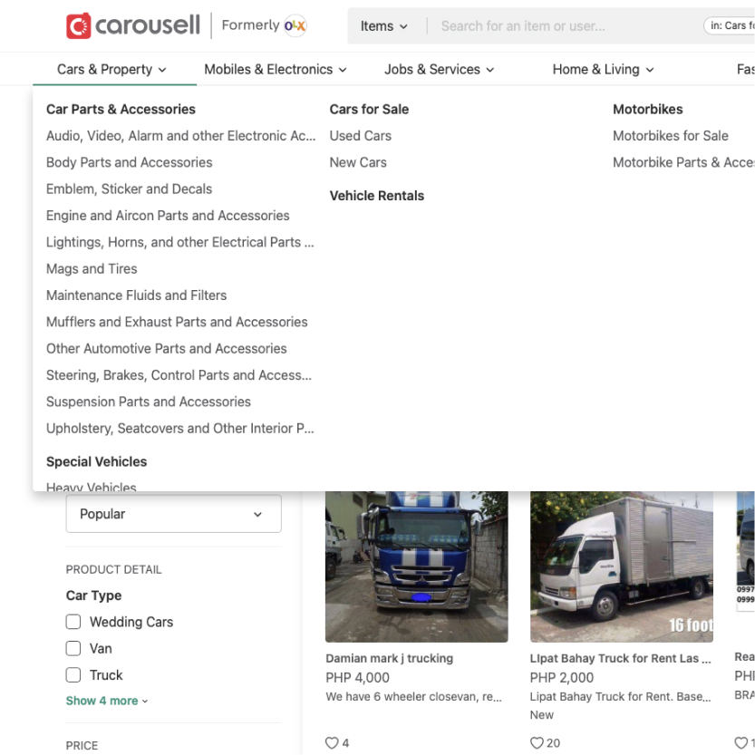
    <figcaption>Old global navigation</figcaption>
  

  

    <video autoplay loop muted playsinline src="./images/nav-3.mp4"></video>
    <figcaption>New improved global navigation</figcaption>
  

### Mobile Web

Due to the complexity, we don’t do responsive web. Instead, we separate desktop and mobile web experiences. So we can build a better experience for specific each platform.

  

    <video class="Round" autoplay loop muted playsinline src="./images/mobile-car.mp4"></video>
    <figcaption>Used Cars</figcaption>
  

  

    <video class="Round" autoplay loop muted playsinline src="./images/mobile-property.mp4"></video>
    <figcaption>Property</figcaption>
  

## A refined listing detail
Together with new landing pages, we also want to improve the experience for the highest traffic page: listing detail.

Different categories have different attributes. To make it easier to design, we broke them into 4 main categories:

1. Cars
2. Property
3. Service
4. General Goods (Electronic, fashion, furniture,…)

There are different needs for showing information for each category. Some categories have many attributes (Cars, Property), some have fewer attributes (Service, General goods).  But we aim to smoothen the experience when people browse in different categories. So we want to have one design that fits all categories but still customizable.

For each category, we defined key attributes, secondary attributes, and common attributes then group them.

  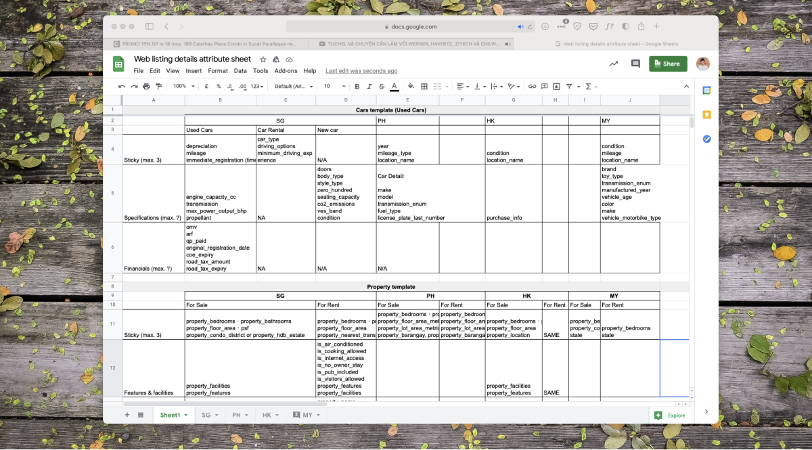

We conducted many usability tests with different types of users, we finally created a new web listing detail with better design and enough flexibility so it fits across diverse categories in Carousell.

  

    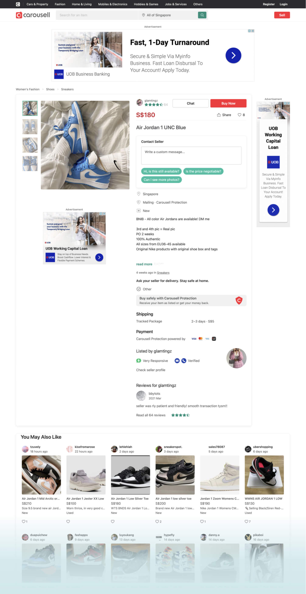
    <figcaption>Old design</figcaption>
  

  

    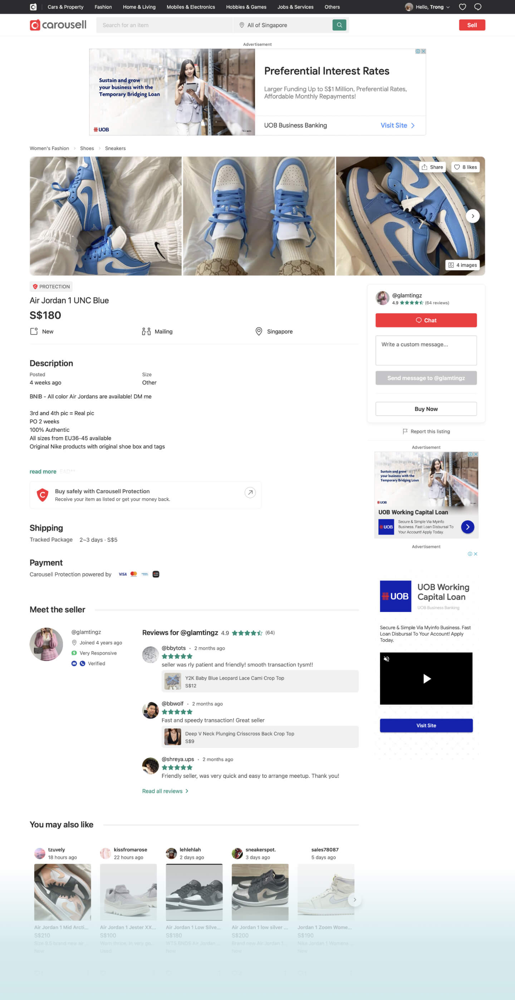
    <figcaption>New design</figcaption>
  

  <video class="Round" autoplay loop muted playsinline src="./images/listing-detail-walkthrough.mp4"></video>
  <figcaption>New design walkthrough</figcaption>

  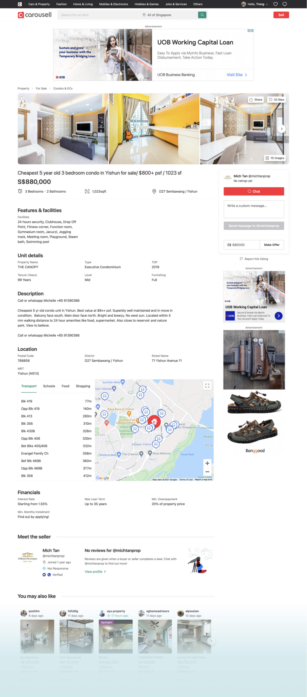

  

  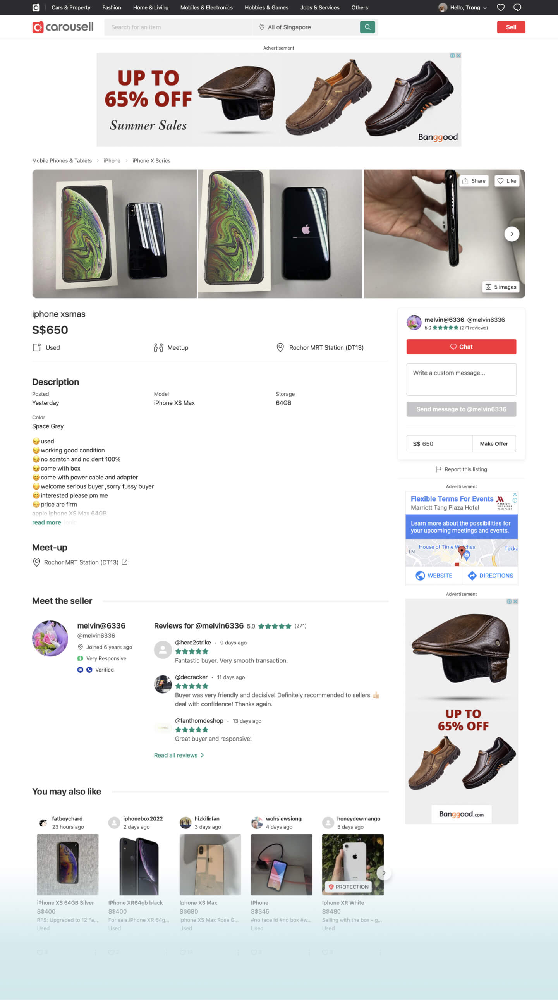

  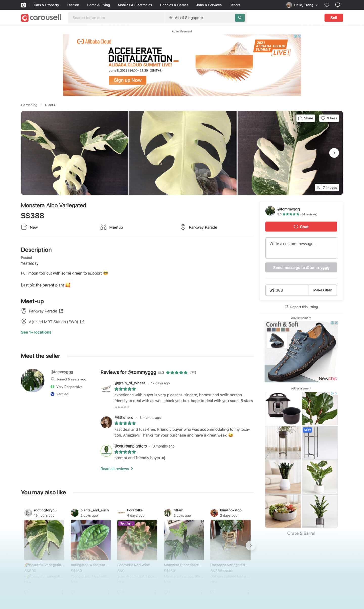

  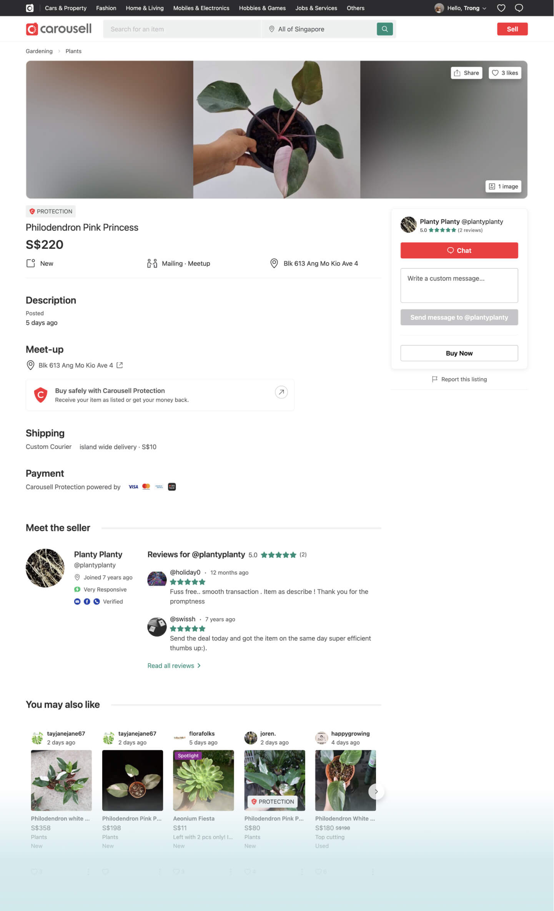
  <figcaption>Edge case with AdsBlocker enable and one image in the gallery</figcaption>

Different CTAs for each type and state of the listing

  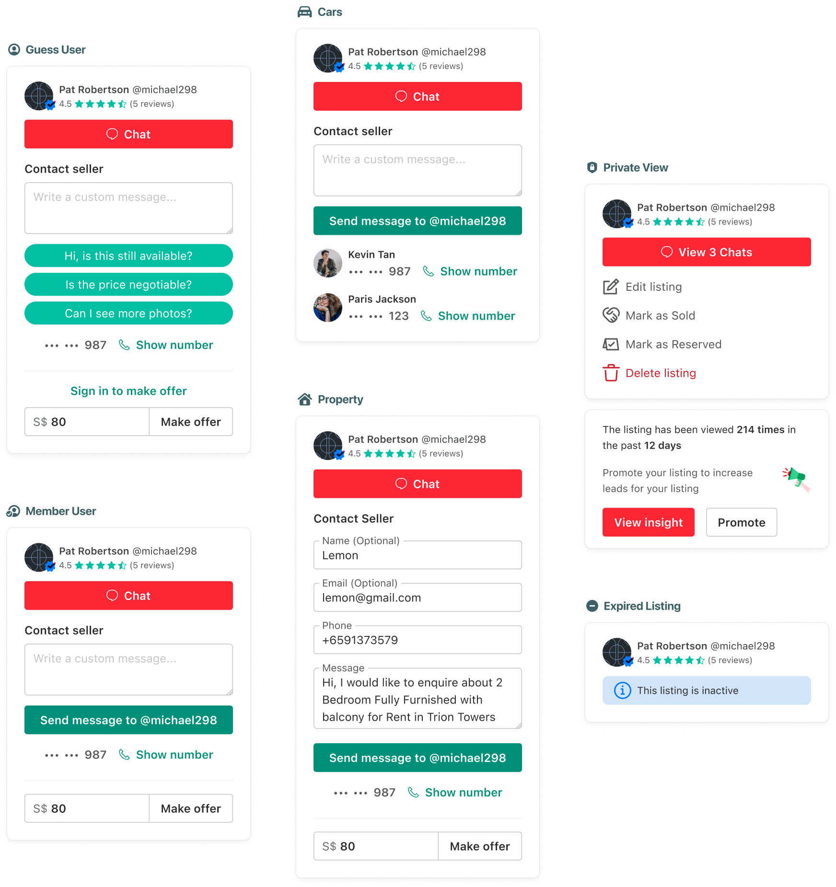

###### The impact
## Positive results and much more to do
- Chat / user increase by +15%
- Transaction / user increase by +12% 
- Total user chat increase by +2%
- No negative impact for external ads revenue

It also built the foundation for the future to customize the experience for different focus categories.

*For confidentiality reasons I have omitted the actual values for these metrics.*

## Credit
My role: Designer Owner

Thanks for design feedbacks from folks: Felipe, Anh Pham, Keith, Jianyuan (PM).

Engineers: Andrew, Phat, Bui, Wilson, Jenny, and everyone else.

Visit [Carousell Cars →](https://www.carousell.sg/used-cars-singapore/h-1233),  [Property →](https://www.carousell.sg/property-for-sale/h-377)