

  

      <h5>Platform</h5>
      
<i>iOS, Android, Web</i>

  

  

      <h5>Country</h5>
      
<i>Philippines, Singapore, and others in SEA+</i>

  

  

      <h5>Duration</h5>
      
<i>6 months and continue</i>

  

---

Started in 2012, Carousell launched the first mobile app in Singapore. In 2020, Carousell transformed into the biggest classifieds marketplace in Southeast Asia, with 20+ million users across 7 major markets.

In 2019, after acquired and migrated OLX Philippines, Carousell became the biggest classified marketplace in the Philippines.

The app was primarily designed for Singapore, a small country, struggled to scale to multi-city countries like the Philippines, Malaysia, Indonesia.

Rebuilding the location while browsing and searching for items is one of the most important things we need to improve.

  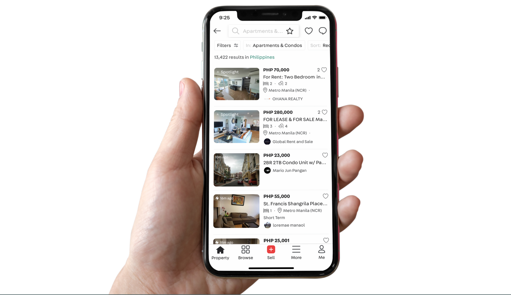

###### The Challenge
## A better location treatment works across all countries and categories

We have three high-level problems that we need to solve:

1. How to make the location picker easier to use for everyone in different countries?

2. How to make it works for different categories (General goods vs Property vs Home Service) when the searching behaviour is very different?

3. How to increase the relevancy on browse and search journey?

## My role
I led the design of the new location picker across iOS, Android, mobile, and desktop Web since the outset of the project in May 2020.

  

    <h4>Insights & Ideation</h4>
    
I partnered with three product managers and two other designers to uncover insights, ideate, and translate concepts into features.

  

  

    <h4>Planning & Scope Definition</h4>
    
I defined the product with my product manager. I prioritized and negotiated features for launch and beyond.

  

  

    <h4>Design Execution & Validation</h4>
    
I designed for iOS, Android, mobile Web, and desktop Web. I executed journeys, wireframes, prototypes, usability test, design specs, and collaborate with Engineers.

  

  

    <h4>Leadership</h4>
    
I presented works to gain buy‐in from executives, senior stakeholders, and many other teams throughout the project lifecycle.

  

## Early insights

### The current location approach

The app was first designed for Singapore so we took the radius approach. When searching items, buyers pick a location and use a radius to expand or collapse the area to filter the items.

  

    

      This approach works for countries like Singapore, Hong Kong, and Taiwan where the transport is convenient and small. People can go anywhere with convenient public transport.
    

    

      When bringing it to bigger countries like the Philippines, Malaysia, Indonesia, people don’t understand it. In another word, the radius is not useful there, where 1km from a location could mean in a different city or an inaccessible area.
    

  

  

    <video class="Round" autoplay loop muted playsinline src="./images/video-radius-2.mp4"></video>
  

### Feedback from users
We reached to our Customer Voice colleagues frequently to ask them for feedback from our users. After migrated OLX to Carousell, we got a lot of feedback about the location.

Many people don’t know how to use the radius location picker:

  

Some people don’t know they can filter by locations

  

Not only getting insights from Customer Voice, but I also dived into some user researches that other colleagues did in the Philippines to get a deeper understanding

  

  

###### A deeper understanding
## Backup with data
Qualitative insights from users are not enough to convince stakeholders to invest in this project. I worked with a PM and Data Analyst to pull out some data to cover for our assumption. We know that:

- If people use the location filter, the View listings to Transaction conversion is 50% higher than without using the location.
- The further away listing from the user’s location, the lesser chance of being transacted.
- The usage of location picker is very high in multi-city state countries (15%), but very small in Taiwan, Singapore, and Hong Kong (2%).

Note: For confidentiality reasons, I have omitted the actual values for these metrics.

###### Frame the problem  
## The importance of location
Carousell is a classified marketplace, more than half of the listings are used ones. People usually do meet-ups to check the item before buying it. So knowing the location around their areas is very important.

To make it easier to communicate our ideas to other people, we created a storyboard to convey our understanding.

  

    
  

  

    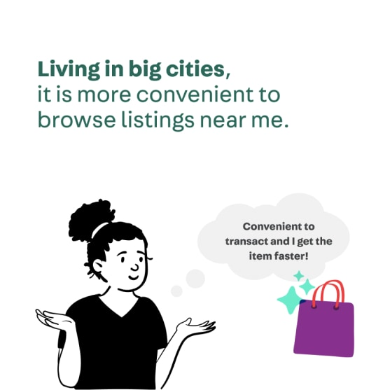
  

  

    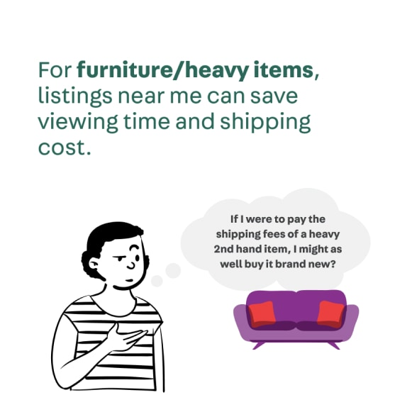
  

  

    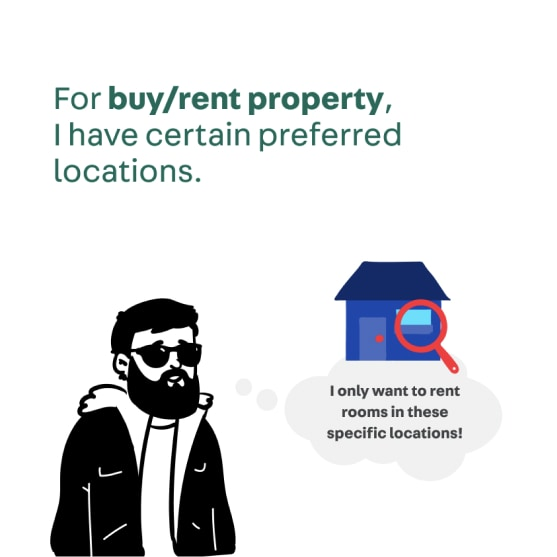
  

  

    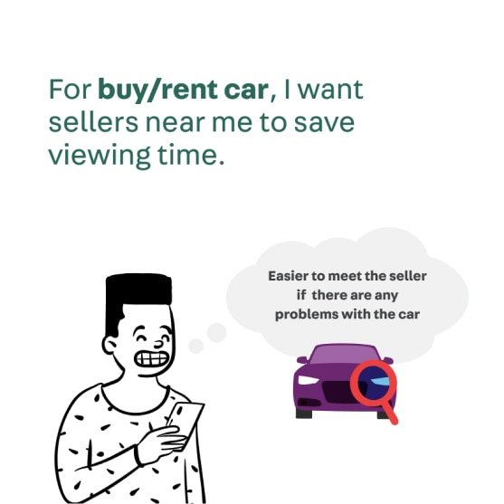
  

  

    
    <figcaption>Thanks to Felipe and Mag for those amazing storyboards</figcaption>
  

###### Explore ideas
## How we built it
After everyone was on the same page and got a common understanding of the problem and the importance of location. With two Product Managers and two other designers, we did brainstorm to find ideas and prioritized what we should do for the new location pickers.

(Pssst: Thanks for Miro that we can do online brainstorming in the pandemic period).

  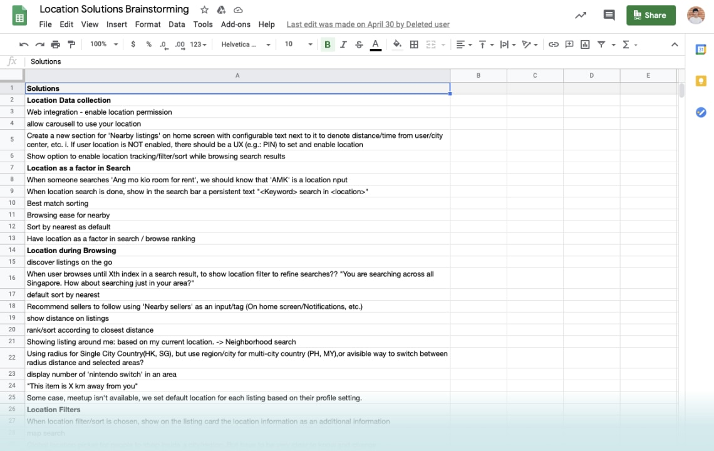

### Rough wireframes/mockup to communicate ideas
In a big organization, the earlier we share, the smoother process.

To communicate our ideas early, I started with wireframes (web) and rough mockup (app) then share with other designers to get feedback. It’s also a good deliverable to share with people outside of product teams about the solution.

  

    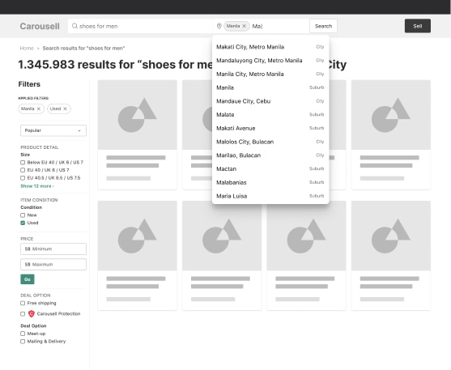
  

  

    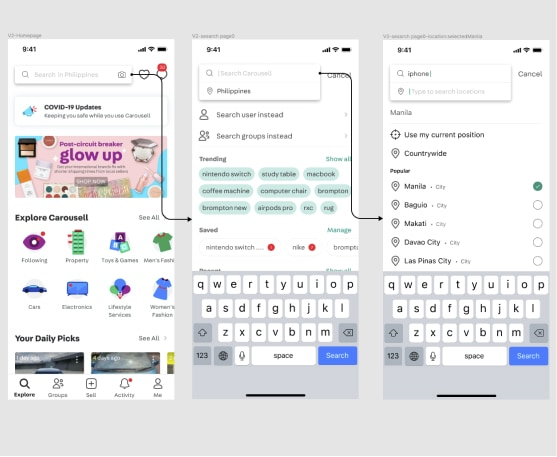
  

### Narrow down ideas and usability test
Many times, designers have many ideas and don't know which one is better. The same thing happened to me. But it's a soft headache. 

First, I tried to come up with many ideas as possible. Then I picked some and share it with the whole Product Designer team to discuss designs.

  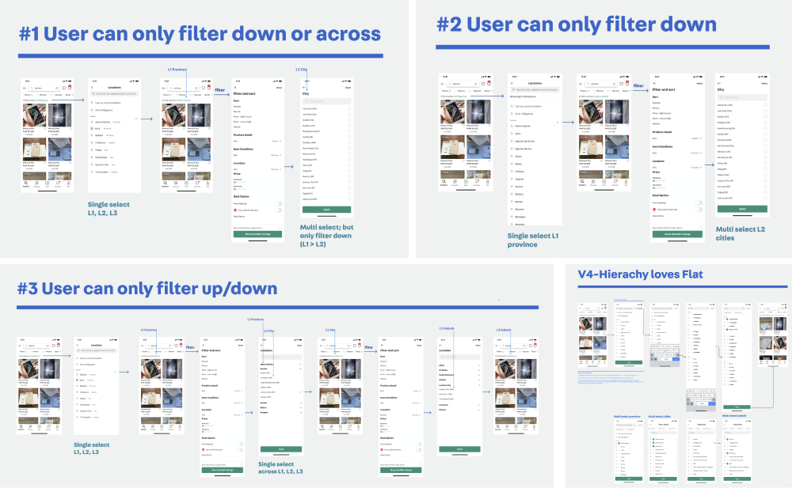
  <figcaption>Location picker flow ideas</figcaption>

Then I updated the design and shared it with stakeholders, including PMs from other teams, category managers, and country managers to get aligned with the direction.

After that, there were still two ideas that we can’t agree on. So I used both two ideas to do a usability test to see how people interact.

  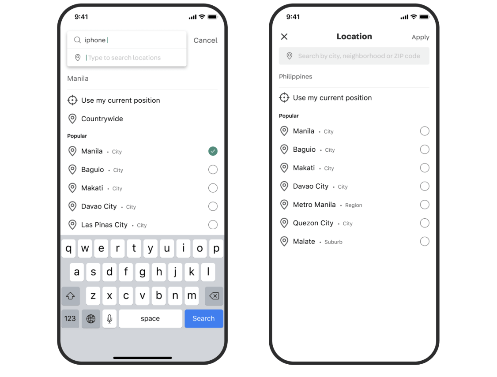
  <figcaption>Which one is better? I don't know</figcaption>

The good thing during the pandemic period is that we don't have to limit the participant physically. So we can recruit people in the Philippines without going there. With a bit of preparation, we did it very smoothly.

With the insights from the test, we are more confident with the solution and get alignment from the team. And I’m confident to spend more time in the detail and refinement.

###### Details
## Introduce new location picker

  <video autoplay loop muted playsinline src="./images/video-real-location-1920.mp4"></video>

  

    <h4>Browse by location areas</h4>
    

      Moving out from radius location, replace it with location areas.
    

    

     They can search for the most common administrative areas. 
    

  

  

    <video class="Round" autoplay loop muted playsinline src="./images/video-new-1-new.mp4"></video>
  

  

    <h4>Localise for different countries</h4>
    

      For big countries like the Philippines, Malasia, Indonesia, we focus on search experience. People can search by Province, City, or Baranggay.
    

    

      For city-state countries like Singapore, Hong Kong, Taiwan, people can also browse by MRT, Area, or Neighbourhood.
    

  

  

    <video class="Round" autoplay loop muted playsinline src="./images/video-new-1_2.mp4"></video>
  

  

    <h4>Multiple locations</h4>
    

      People can select multiple locations when searching for listings. They are usually where they work and where they live.
    

  

  

    <video class="Round" autoplay loop muted playsinline src="./images/video-new-2-new.mp4"></video>
  

#### Useful shortcuts
Quickly filter listings by personal locations

  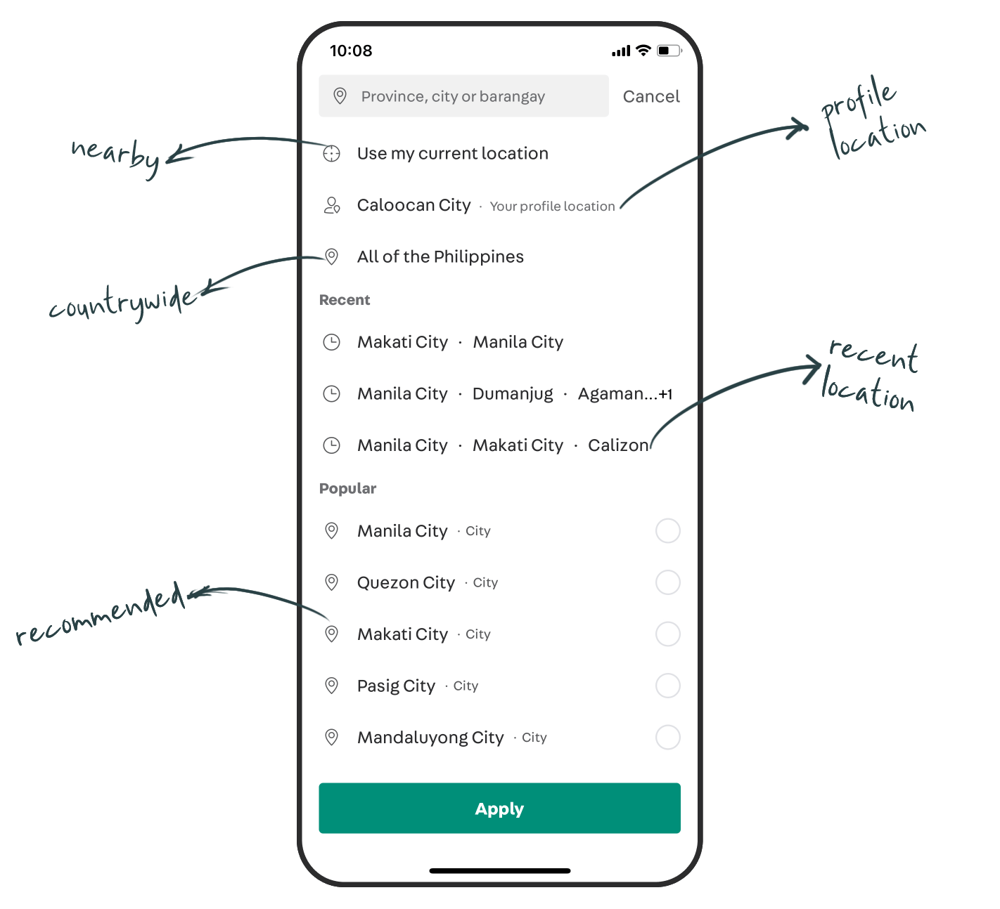

  

    <h4>For Property</h4>
    

     Location is the most important criteria when searching for any house or room. So we replace the global search bar with the location picker.
    

    

     In Singapore, property users can browse by Area District, Estate, MRT or neighbourhood.
    

  

  

    <video class="Round" autoplay loop muted playsinline src="./images/video-sg-property-2.mp4"></video>
  

#### Property listing card

For property, we created 2 new listing card layout, list view and gallery view, to show more information. Location of a house is an important information to help people find suitable houses easier.

  

    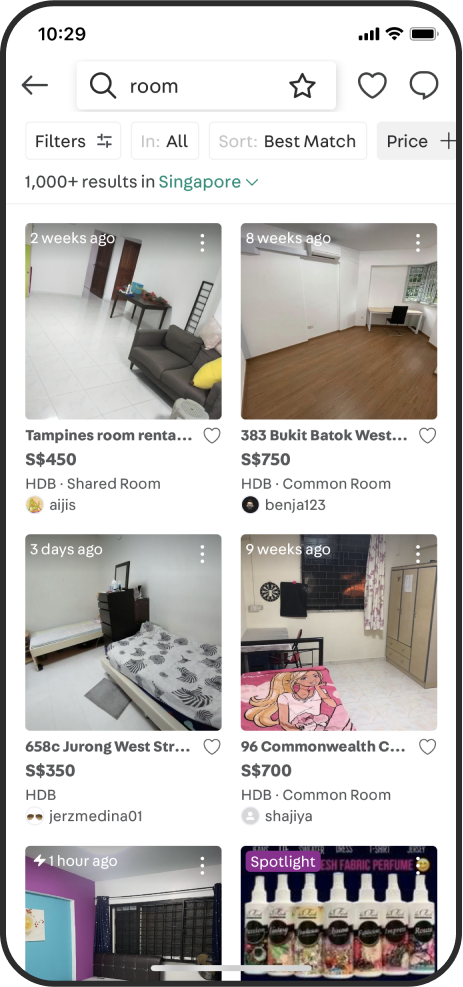
    <figcaption>[OLD] Grid view</figcaption>
  

  

    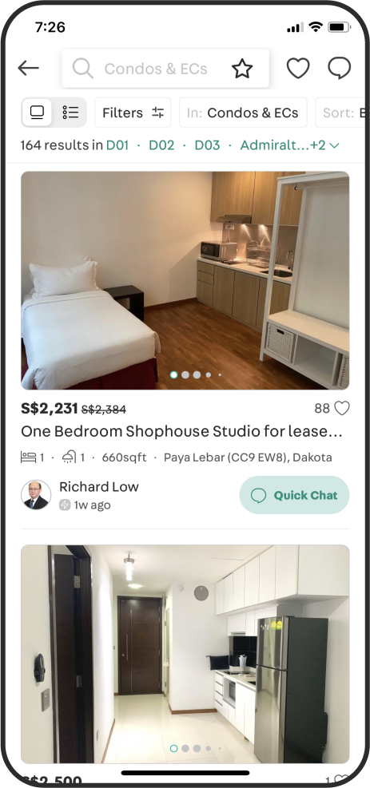
    <figcaption>[NEW] Gallery view for scenic route</figcaption>
  

  

    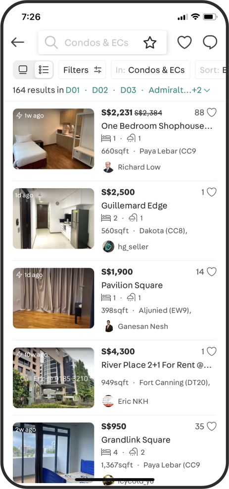
    <figcaption>[NEW] List view for detail driven</figcaption>
  

  

    <h4>Clearer system feedback</h4>
    

      Number of item indicators to show the system state as a guide for people to decide if they should use filter to narrow down or change to a bigger area to see more available items. 
    

    

      We didn't have it before because we didn't want our competitors to know where we are in the market. But it’s useful info for buyers while search. So we have to find a way to balance it.
    

    

      So we decided to show it by package: 10,000+ 7,000+ 5,000+ 1,000+ and exact number if the number is smaller than 1,000.
    

  

  

    <video class="Round" autoplay loop muted playsinline src="./images/video-result-2.mp4"></video>
  

#### And it works across all platforms

iOS, Android, Mobile Web and Desktop Web

  

    

      <video autoplay loop muted playsinline src="./images/video-android-2.mp4"></video>
      <figcaption>New location picker on Android</figcaption>
    

    

      <video autoplay loop muted playsinline src="./images/video-dweb.mp4"></video>
      <figcaption>Desktop Web</figcaption>
    

  

###### The launching
## The first release: low usage but good Conversion Rate (CR)
After 5 months of design and implementation, we released it first in PH in Dec 2020. One month went by, we got the data and some qualitative feedback from users:

* The usage is lower than we expected: lesser people use the location picker, comparing to the old one.
* But on the other hand, the CR funnel improved a lot. The funnel when people browse → Chat increases by +18%.

At least, we know that the new solution brings a better experience, people can find things they want easier. Then the main questions are **why the usage is very low** and **how to increase the usage.**

Then I collaborated with a PM, DA to analyze the data. The reason we found out is the sticky behavior of the entry point.

Why did we know? Because before we launched the new design, we had made a change in the behavior of the entry point of the old location picker. The usage declined from the time we made that change.

  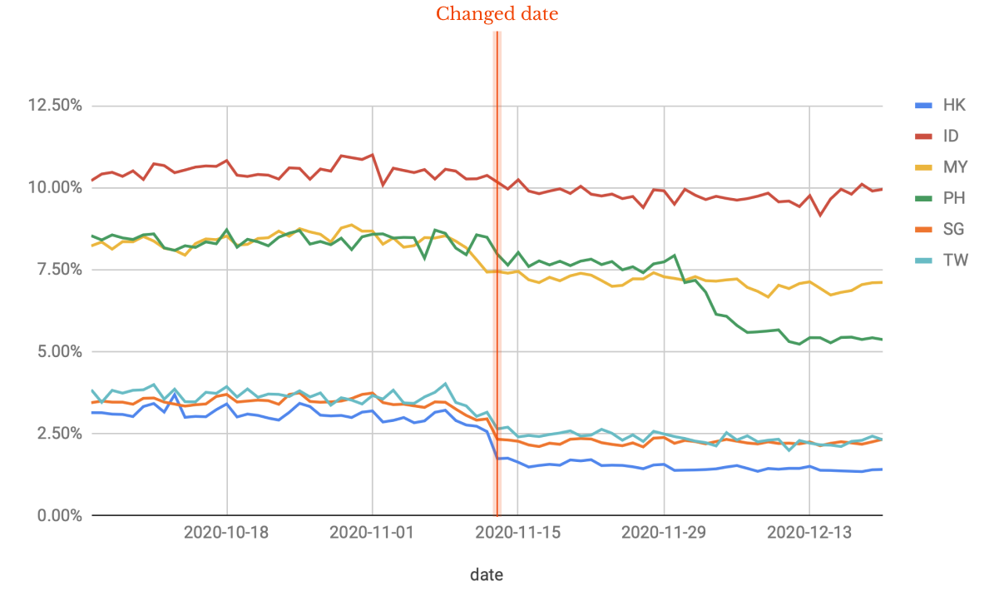

Besides data, we also receive some user feedback sent to our User Voice team.

*“The items do not appear compared to the old search mechanics" – Kim*

*“Location search was accurate in the previous version. Updates showing (listings) very far locations from my city which is not accurate” – Mico*

So not only the design, but we need to change also the logic of the result page.

### Next iterations
When we want to increase the usage of a feature, we are tempted to use onboarding or tooltip to tell people about that new feature. That's always our first thinking.

But explaining to people how to do something is a sign of bad design. So what we did?

**Sticky entry point**

  

    <video class="Round" autoplay loop muted playsinline src="./images/launch-sticky-old.mp4"></video>
    <figcaption>[1st release] The entry point is flown when scrolling down</figcaption>
  

  

    <video class="Round" autoplay loop muted playsinline src="./images/launch-sticky-new.mp4"></video>
    <figcaption>[New release] Make the entry sticky on top and adding a chevron to make it more visible and tappable.</figcaption>
  

**A/B test the logic filtering listings**

  

    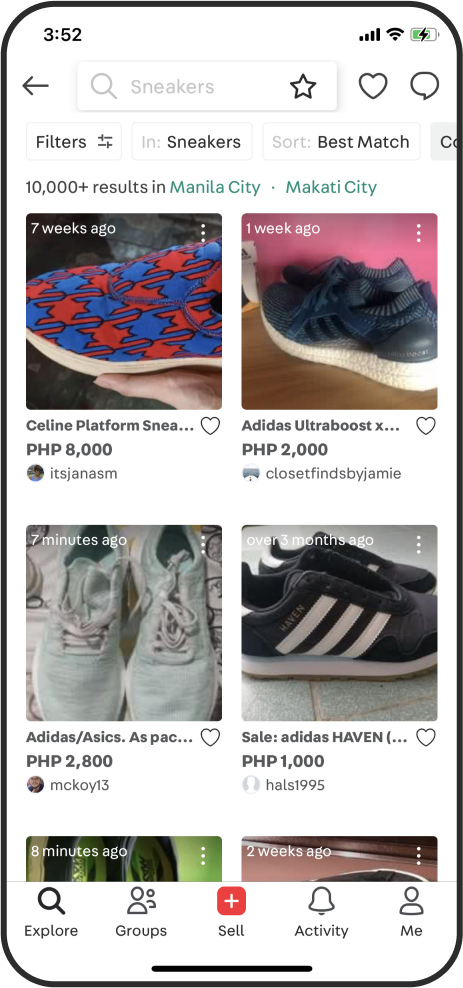
    <figcaption>[1st release] Results include both mail delivery (no meetup) and meetup listings</figcaption>
  

  

    
    <figcaption>[New release] Showing only listings with matched meetup locations</figcaption>
  

**Changing the order of administrative**

  

    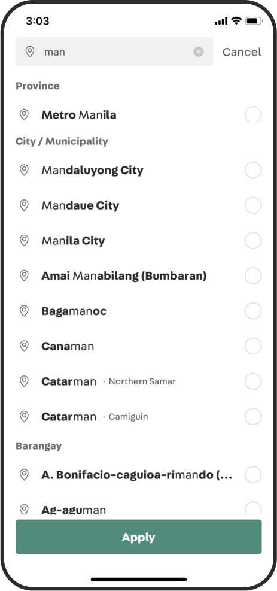
    <figcaption>[1st release] Sort from top to bottom</figcaption>
  

  

    
    <figcaption>[New release] MCity moves to the top due to the usage</figcaption>
  

###### The impacts
## Positive results and much more to do

Launching is only the first step. In Carousell, we always iterate the product with data and post-launch research.

Through some iterations that learning from data and user feedback, we got great impacts:

- +80% in feature usage
- +18% in browse → chat
- +28% in browse → quality chat

We launched it first for the Philippines, Singapore, Hong Kong. Then Taiwan, Malaysia, and Indonesia later.

*For confidentiality reasons I have omitted the actual values for these metrics.*

---

## Credit
My role: Design Owner

Thanks for the design feedbacks and discussion from designer and PM folks: Felipe, Mag, Keith, Huiyi, Ashutosh, Jianyuan.

Thanks to all engineers who worked hard on this project: Beemo & Darren (iOS); Tim & Lance Wang (Android); Jenny, Chenghua & Andrew (Web); and genius back-end guys Steven, Tuan & CCC.
