A long time ago, I read an article about a tip to boost our confidence, [a Good shit boare](https://forge.medium.com/write-down-every-compliment-you-get-352279768b5a), where we put all compliments we get from the other people. So when you have a bad day, you can come back to this board and read those compliments to boost your emotion up.

> “The Good Shit board is a lifeline on days when work feels frustrating. It’s where I go to celebrate my wins, providing a confidence boost anytime my morale takes a hit after a rejection or roadblock.”
> <cite>- Lauren Sieben </cite>

Celebrate small wins is important. They are powerful motivators to reaching larger goals, even if they aren’t direct steps to help us get there.

On Mar 6, 2020, I launched my website awesomefigmatips.com. I launched it by… a tweet on Twitter, where I had under 100 followers. Most of them are inactive because I didn’t use Twitter much in the past. But the good thing about Twitter is I can mention anyone. That time, I mentioned @figmadesign, of course.

I got some likes, some compliments from strangers. And I still remember how I felt when I see a like from @figmadesign. I was so happy when seeing it, even it was just a Like. But still, no many people know about it.

  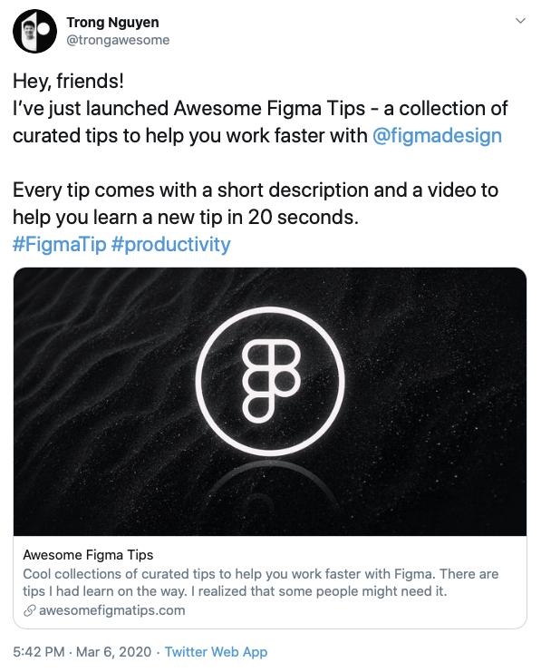

Until now, 6 months later, the site is getting some attention. Some people share it, some popular design newsletters featured it, some websites feature it. And this is the biggest happiness when making something, to see the thing we make is useful for other people, and knowing that people are happy when using it.

Today, I want to create a Good Shit board for my project Awesome Figma Tips to remind me about the happiness of being a product designer. And someday in the future, If I feel bad, I would come back and boost my mood up.

## Featuring on some popular design newsletters

  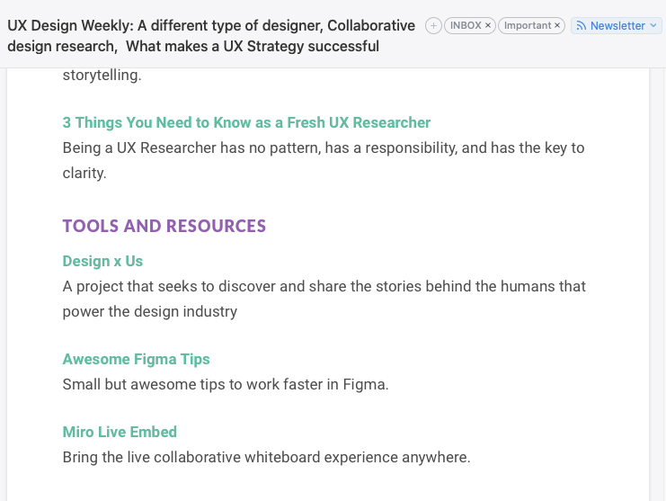
  <figcaption>UX Design Weekly</figcaption>

  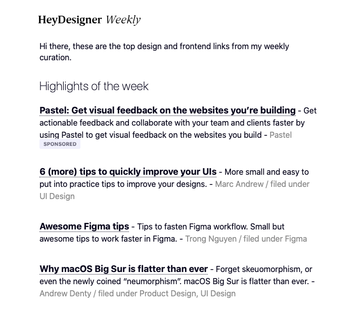
  <figcaption>HeyDesigner Weekly and Daily</figcaption>

## Featuring on some design resource sites

  
  <figcaption>Sidebar.io</figcaption>

  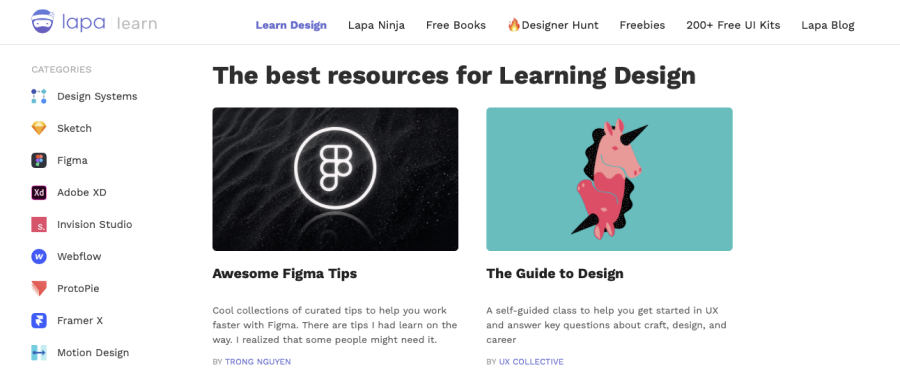
  <figcaption>Lapa.ninja</figcaption>

## And many tweets

  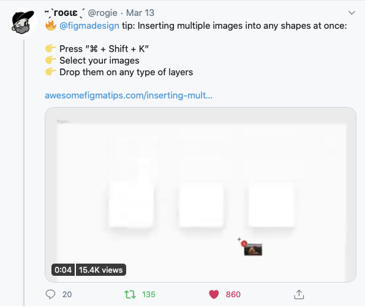

  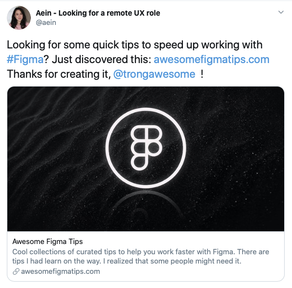

  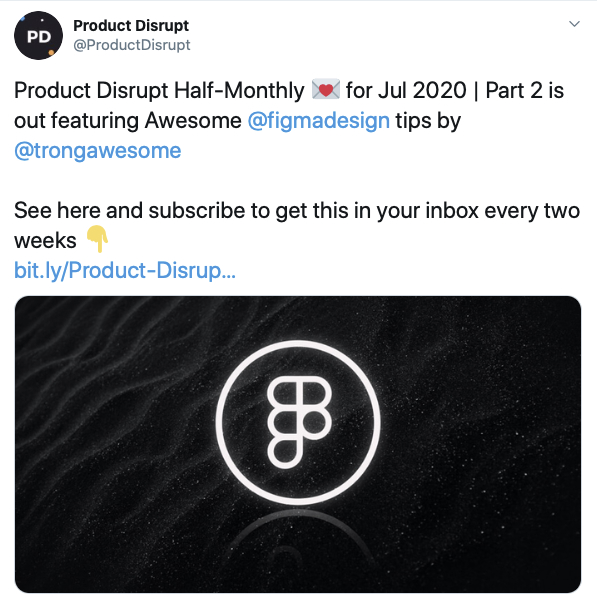

  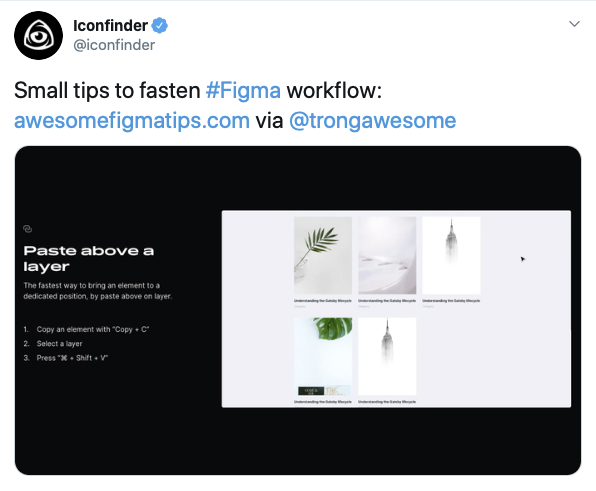

  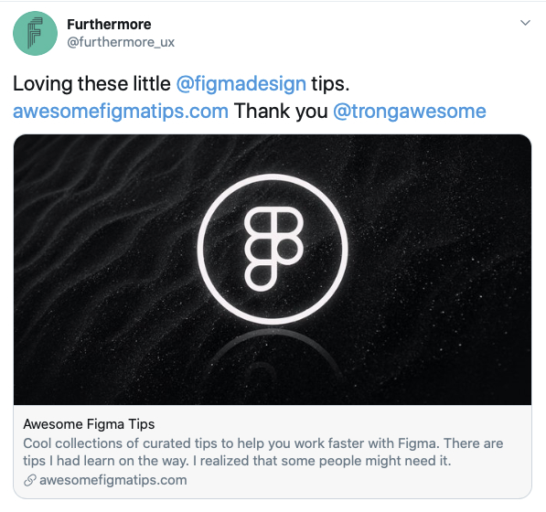

  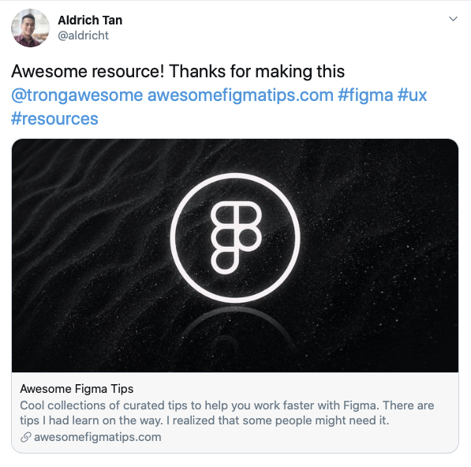

  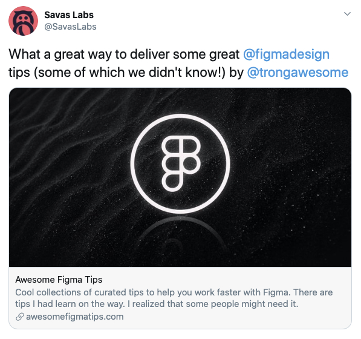

  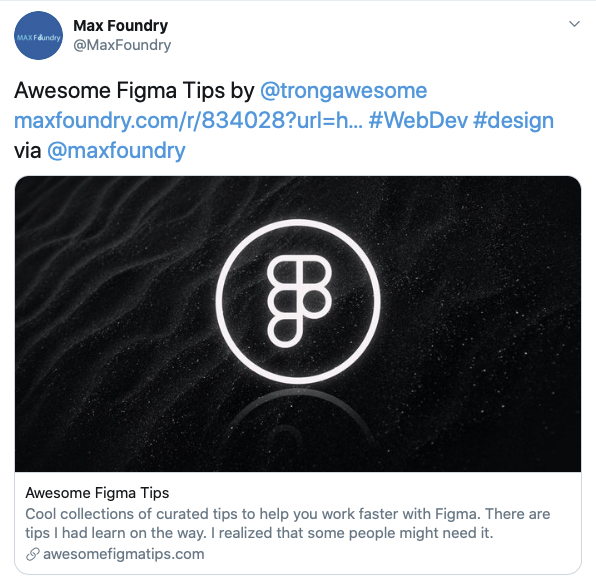

  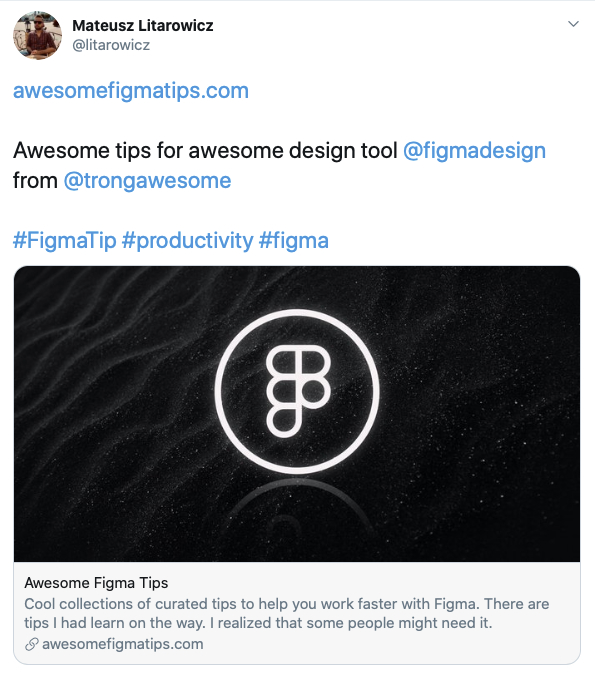

  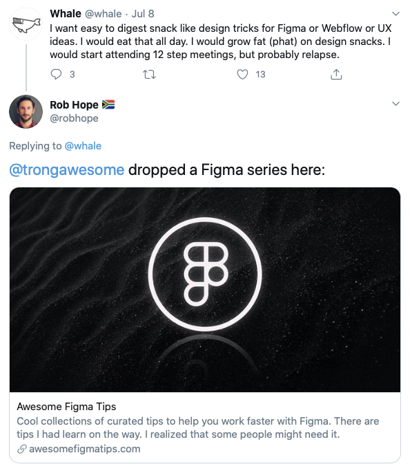

  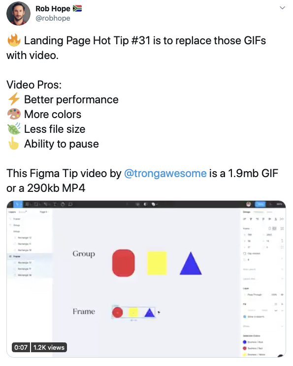

  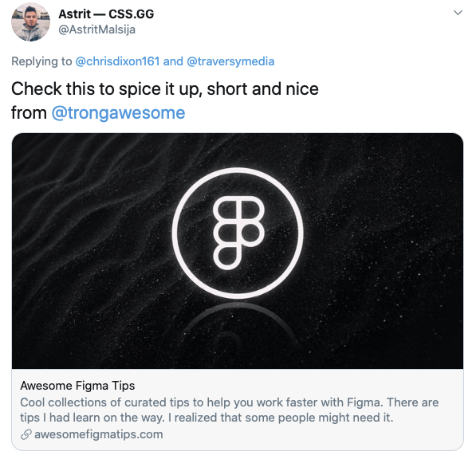

  

  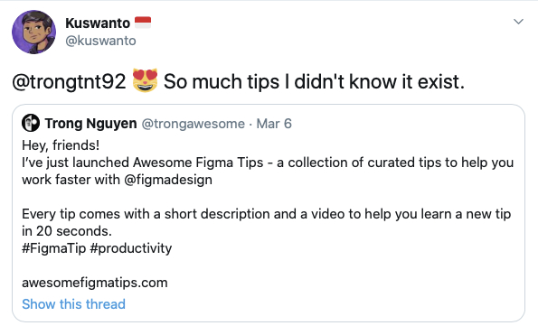

Thank everyone for sharing my work. Making a useful thing is my happiness.

Psst: In next posts, I will share how I made that website and also the making of another side project I’m working on. So stay tuned!
