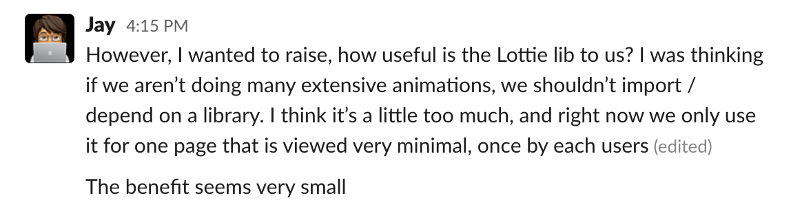
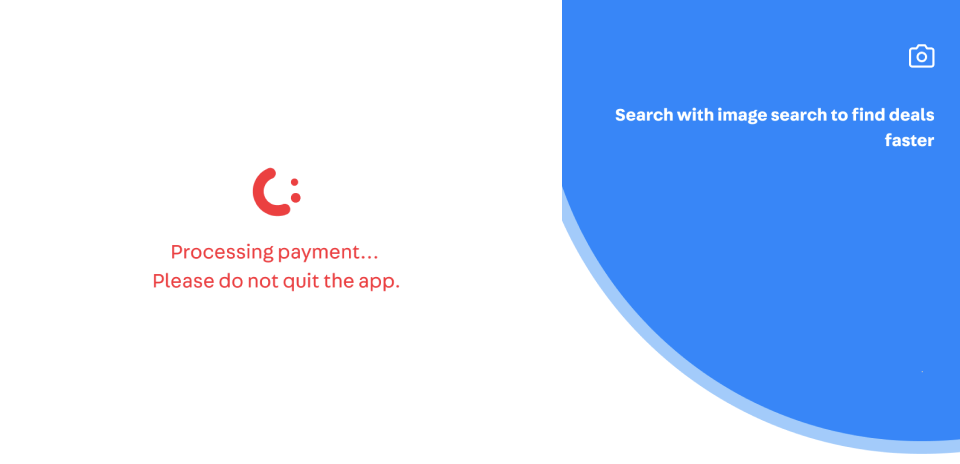
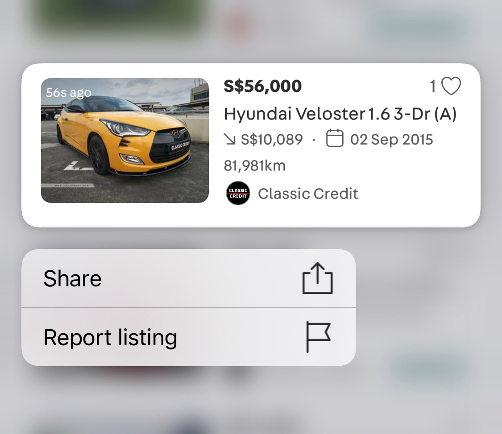

In the past year, I worked on some projects and learn some interesting things about animation and their values in user engagement and business.

I hope the insight we’re going to share will be helpful and can give you some inspiration for your next features.

Let me tell a story about the Like button.

## A story about the Like button
5 months ago, when building the list view listing card for cars and property, the Vertical team wants to do something fun. One of them is adding the like animation every time people like a listing.

  

    

      Inspired by Twitter and Facebook, we add that animation just to make people feel less boring when using an “e-commerce” app.
    

  

  

    <video class="Round" autoplay loop muted playsinline src="./images/like.mp4"></video>
  

We ran an A/B test in one month, we got the data. Surprisingly, the number of listing that was liked from card increased by **150%.**

It’s a huge increase. That number says that people are more engaged when using the app and it also can bring more lead to the listing detail page because many people go to listing detail from their Like page. Besides that, the lesson from it is important.

And this is a great example of how animation can help to delight people and bring value to the business.

## Where are we right now?
Early this year, when Jay, an iOS engineer, and I worked together in the Design System project, he complained to me that since we added Lottie to the app, but we don’t have many animations. We only a few basic animations. It’s not worth it to use an external library for very few animations.

  

I couldn’t agree with him more, we’re having very few animations in the app. All we had before were the spinner and onboarding.

  

## Where do we envision ourselves to be in the near future?
Carousell app isn’t purely for transactions, we’re building a community. So we need more meaningful things to spark joys in people, to connect them with our app, to make people feel they are interacting with a human, not a cold machine.

There are many opportunities for us to delight our users with meaningful animation.

In the last couple of months, we started to add more animation to the app and it brings very good results. Here are some good examples.

## Long press
Remember the list view listing card at the beginning? Another fun thing we did was to leverage gestures on mobile to simplify the design by hiding some actions at the surface level.

  

List view listing card is a brand new view in Carousell, we haven’t used it before. So when launching it, we didn’t want any ‘metric” to go down. One of them is the “More action” that includes Share and Report listings. 

With the list view, we hide the ‘…’ icon and put those two actions under a native mobile gesture, long press. Many people doubted that fewer people would use Share and Report because it’s not visible.

At the beginning, we wanted to add a Tooltip that says “Hey, we have more action when you long-press.” or something similar to get people’s attention. But when we looked back to the app and saw that we’re using too many tooltips, it’s everywhere. It’s interruptive and people don’t read.

Then how?

Dave, our iOS engineer, came up with a genius idea:

“What if we add a subtle animation when people tap on the list view? That can give people a hint that there is something more if you tap longer."

  

    <video class="Round" autoplay loop muted playsinline src="./images/longpress.mp4"></video>
  

We’re not sure about it, but it was worth it to test. So rolled out the A/B test with that interaction.

Result? It’s beyond expectation

* 400% increase in users tapping more options from card increased
* 200% increase in users reporting listing from card increased

It’s awesome!

Let me show another example.

## Sparkle animation
We have talked about how we’re overused tooltip and that people don’t read it. Then what should we do when introducing a new feature and really really really want people’s attention?

We need a way that feels less interruptive but still gets people’s attention. That’s why we come up with the Sparkle animation.

The animation is very subtle, people can still interact with the app without interruption. And also it gently tells users that: “Hey, I’m new. Check me out when you have time”.

  

    

      We’re using it for the Toggle button to toggle between List vs Gallery view and for our new feature, Send Quote.
    

  

  

    <video class="Round" autoplay loop muted playsinline src="./images/sparkle.mp4"></video>
  

But of course, we try to not overuse it. The design should explain itself. That’s a much better design.

Thanks for reading