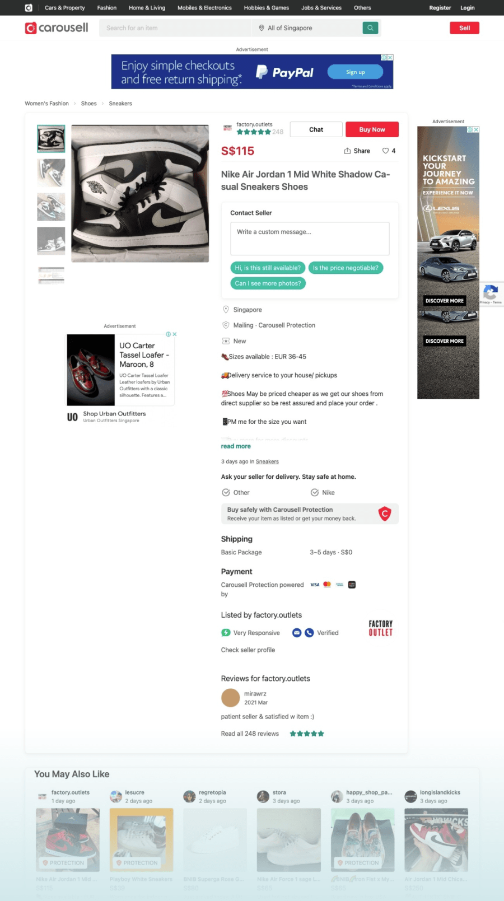
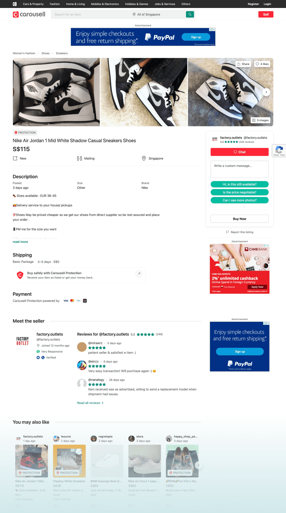
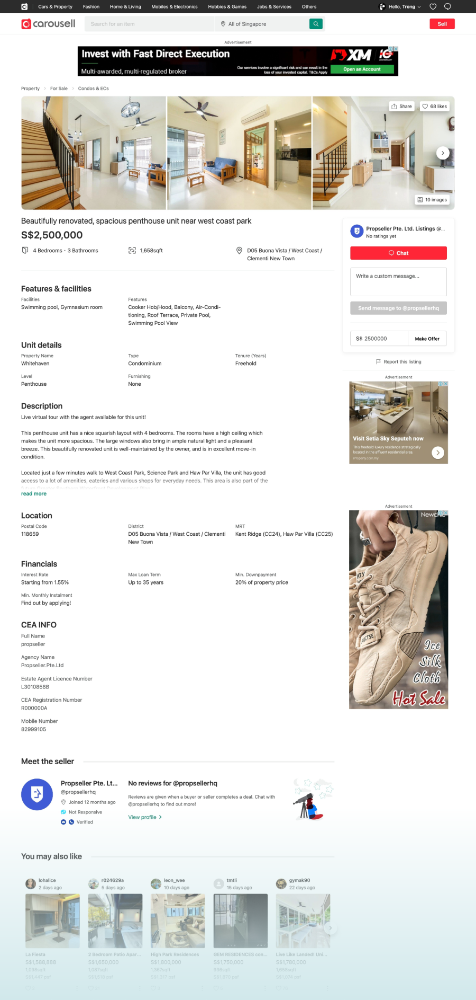
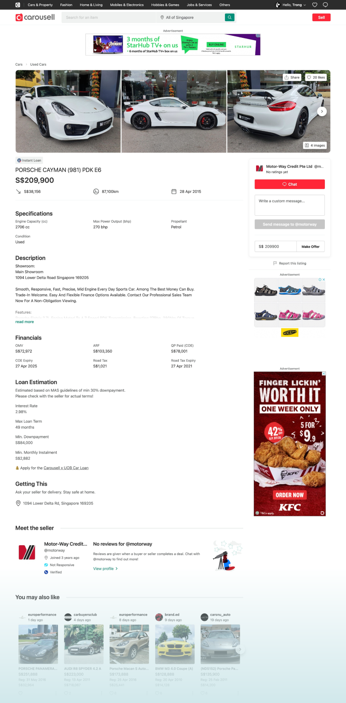
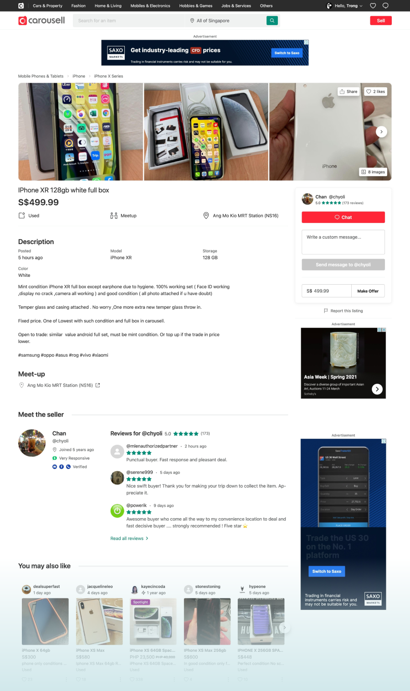
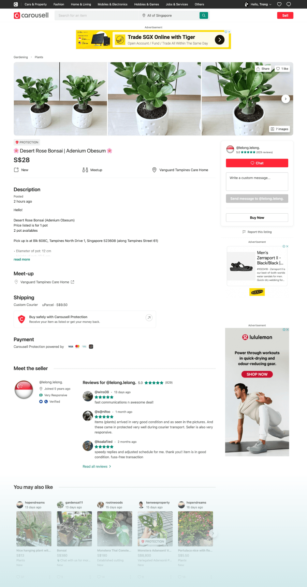
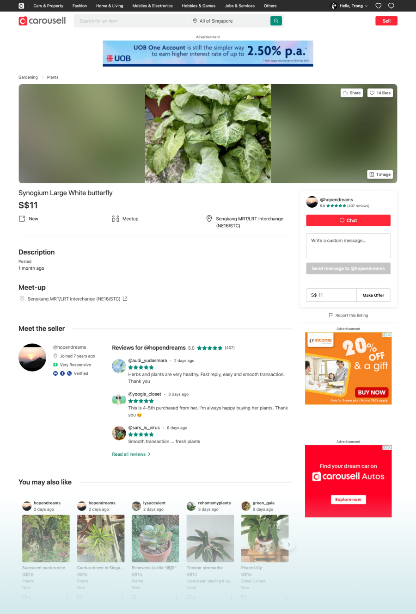

There are many reasons for that. The scope change, the team change, the manager change,…

One of my projects almost falls into that hole. In October 2019, I started to redesign the listing detail page for the desktop web. I spent lots of time brainstorming, ideate, discussed, debated, presented, user research. 3 months later, I had the best design. I was so proud of that design.

I thought it would be the next thing team want to implement. But sadly, my team picked another project to build first. They said that one has a bigger impact, and so on…

So the new design has stayed in the backlog for more than half a year. Luckily, in November 2021, a new web engineer joined our team. We have more people, the new design was selected to build!

I’m thankful for my new web engineer and my patience.

After more than 3 months of building, we released that new design with an A/B test. It’s not fair to do an A/B test with many things that have changed. But in a big organization, we need data to prove whether new changes are good or bad.

I’m very excited to see the result. But first, take a look at the old and the new design to see it looks.

  

    
    <figcaption>Old design</figcaption>
  

  

    
    <figcaption>New design</figcaption>
  

  

  

  

  

  

Looking forward to the result and next iterations.
