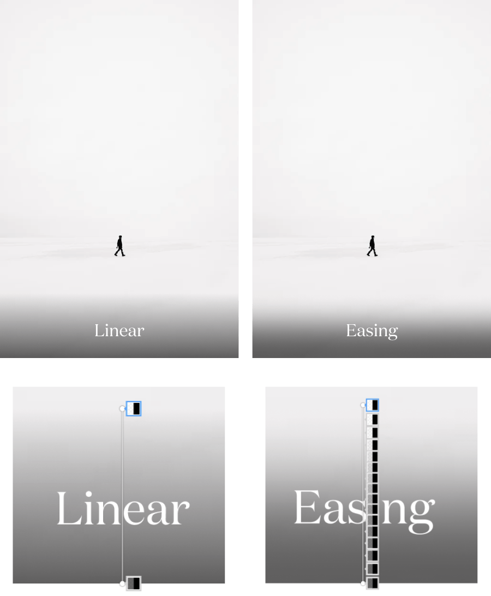

<!--- audio: ./images/audio-example.mp3  -->

First, let’s take a look at those 2 photos from 500px and Unsplash. They have the same idea when hovering over an image, it shows overlay additional info. Tell me which one gives you more aesthetic pleasure?

  

Of course, the Unsplash one is much better. But why?

500px uses a linear gradient for the overlay background. Linear gradients often have hard edges where they start and/or end. When transitioning between colors the edges become prominent if we don’t ease-in-out of it.

We can avoid those by controlling the color mix. The examples below have the same amount of blackness behind the text.

  

To archive that effect on our design, we will have to pick color manually. It will be very painful. But with help from plugins like [Easing Gradients](https://larsenwork.com/easing-gradients/#editor) for Figma, our life will be easier.

##### Resources:

- [Easing Gradients](https://larsenwork.com/easing-gradients/#editor) – Post by Andreas
- [Déjà Vu](https://unsplash.com/photos/R9OueKOtGGU) – Photo by ÉMILE SÉGUIN