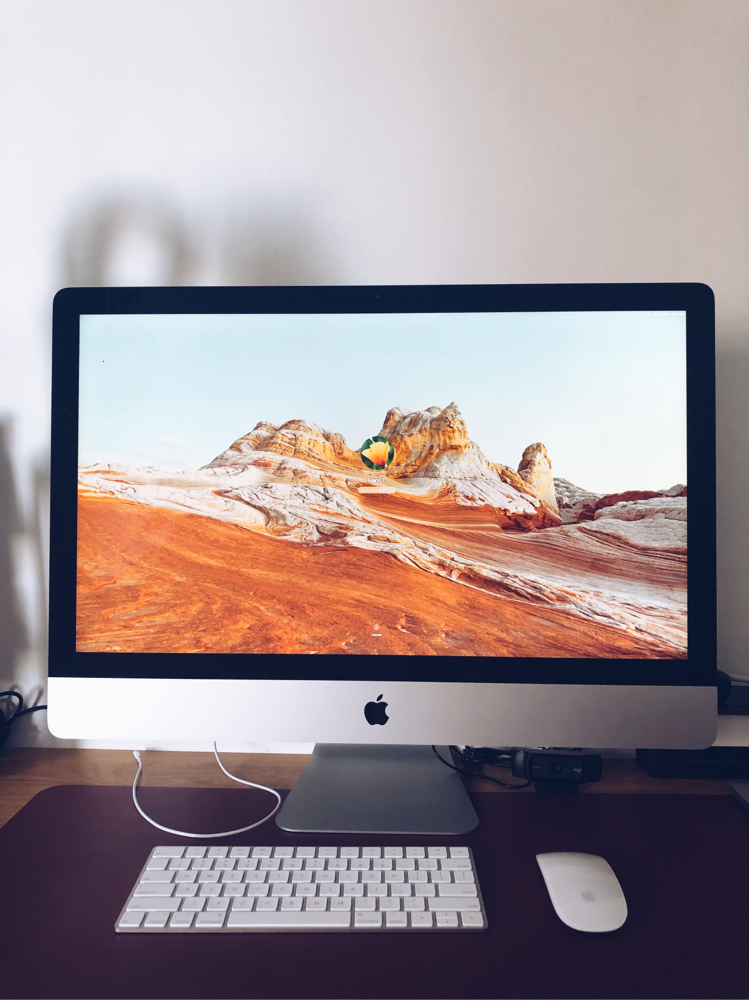
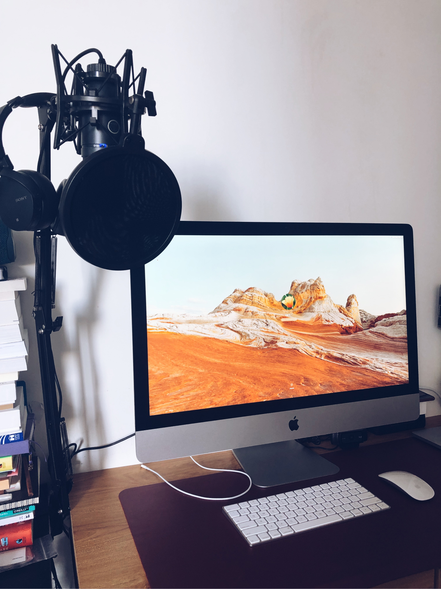

I have thought a lot about if should I buy an iMac to use last two weeks, especially after Apple introduced a new colorful slim iMac 2021 with an M1 chip. It triggers the idea of buying an iMac.

But why a used one, not the new one? I found that the new one is slim and it’s impressive. But sadly, it’s only beautiful from the back. If we look from the front view, it’s nothing more than a screen and I don’t like the light color at the bottom edge of the screen. It’s very subtle and  I feel something wrong with that color choice.

For me, the curve of previous iMac models is the sexiest, the logo in front is awesome. I don’t like logo marks but except for Apple.

After 2+ years living in Singapore, I realize that this is the best country to buy used electronics, especially Apple products. Singaporeans are very rich, and of course, Apple is famous for tech device here. They will buy new products without thinking too much. And so, they have to sell their used one. That’s why the secondhand market here is very lively (And it’s the main reason why Carousell is very successful here).

I’m not a fan of buying secondhand items, but for an electronic device, buying used items in Singapore is the wisest option. I bought this 2020 model iMac at S$1,900. The original price is about S$2,600. This is a very new one. The previous owner bought it last October, but he rarely used it, and it’s still under warranty. So I saved $700. I have to upgrade the RAM if I want to use it for work, it cost S$270 more. Now, this is the strongest and fastest machine I ever have.

When I was young, I used to dream to own an iMac. Somehow I forget that dream, until today. Now I had it. My dreams in the past were very too tiny. I need to dream bigger.

  

    
  

  

    
  

  

    
  

Finally,
Hi Markl's iMac!
