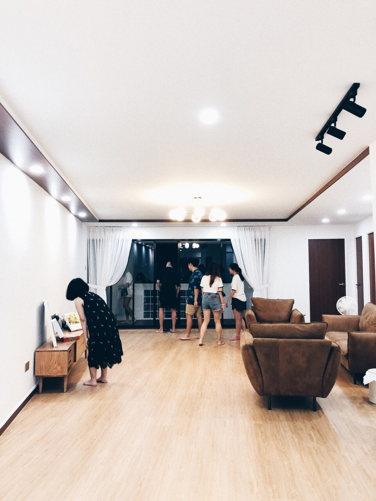
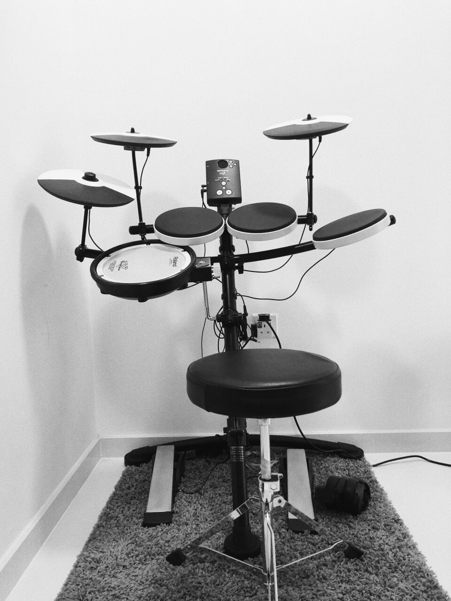
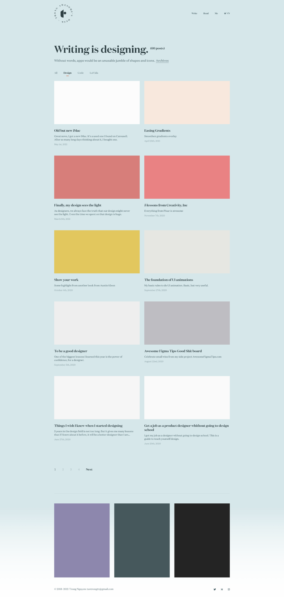

Dear Sunday,

I think writing is the most difficult thing to do. We sit here, want to write, but nothing comes out.

What to write?

Let just do as usual as I do for the morning page in English.

First, this was a long weekend. There was a public holiday on Thursday, I took Friday off. So it was a 4-day weekend. It was joyful.

Wednesday night, Truc and I went to Ha’s house to do a housewarming. She and her husband have just moved into their new house and they invited us to come and do a small housewarming. They did it early because they would want to do something before I go back to Viet Nam (we didn’t at the end).

Ha couldn’t cook. Instead, she ordered Vietnamese food from a Vietnamese housewife and get delivered to their place. There’s nothing better than eating Vietnamese food with friends.

But the greatest one was their house. They are a fan of Japanese spirit and minimalism. They built their house with lots of wood: for floor, doors, table,… everything is minimal. I love that house, love the natural color of wood, love the minimal decor.

After having dinner, we started playing games and drink. Mag went crazy after many glasses of wine. I didn’t know that she was crazy like that after drinking. Crazy but fun. She started to talk, talk and talk with the most honesty from the bottom of her heart, the honesty only comes from a drunk.

We ended up at 1 am. And we had to accompany Mag to her house. Even though we stay in the middle of Ha’s place and Mag’s house.

<div class="Image__Small">
  
</div>


The party didn’t stop there. On Thursday night, Truc’s colleagues organized a dinner. I think they wanted to celebrate Truc’s pregnancy. They wanted to surprise us but we broke it by… coming early.

They had bought some balloons and other stuff to decorate the house to welcome Truc. But not like usual, we came early while they were still decorating. Ironically, the ones who were surprised were them.

But I appreciate their effort. Truc has many good friends. They are not local, an Indian girl, a Filipino man with his Korean girlfriend, and a Malaysian boy. All of them are very kind. Nothing happier than having good friends when living abroad.

Friday was my day off. It’s not a holiday, but I took that day off to rest and do personal things. One of them was packing the drum kit. I felt very guilty that I haven’t practiced it for many months, even though I was excited when first bought it. Maybe not this time.

<div class="Image__Small">
  
</div>


We have to move out end of next month, to a new house or back to Vietnam. We want to deliver in Vietnam but we don’t know yet. Because we have no control over the time. We have to apply to the Vietnamese Embassy and wait for them. But the flight in May was canceled, the newest flight would be on June 6. It will be our last chance. If we couldn’t go on that flight, we would stay here in Singapore. Everything would be fine in the end.

On Saturday, we went to the supermarket to do groceries for the whole week. Covid cases in Singapore were raised again. And the government tighten social gatherings and dining. We could only gather max 2 pax and couldn’t dine in the restaurants and food court. So we have to cook more and work from home.

It wasn’t bad in Singapore now. Daily cases were under 20. But we all know the risk of the new mutants covid-19. So better to prevent it.

Not only in Singapore but daily cases were also raised again in Vietnam and other SEA countries. Hopefully, everything is under control.

Lastly, the happiest thing for the long weekend, I made my site 5x faster by just removing one CSS line:
```
filter: blur(15px);
```
I used this line to blur low-quality preload images before the real image loaded. In theory, this technique helps the site look faster. But I didn’t know that it’s harmful to performance.

By removing that line and some small tricks, the site is even more beautiful now. The detail I will share in a separate post, but now I love my site again and willing to blog more.

<div class="Image__Small">
  
  <figcaption>Posts are rendered with beautiful solid color block</figcaption>
</div>

My last thought, I’m wondering about which language I should use for my future posts. I’m thinking about using Vietnamese since it’s my native language and I can find my niche easier – Young Vietnamese designers. I can write much faster and freely.

On the other hand, writing in English now is better for my career and my learning progress.  My living and working environment surrounded by English speakers. All the books I’m reading are in English. But in writing, it’s challenging to process words in English.

Having resistance is a good sign, isn’t it? It reminds me of wisdom from Seth Godin:

> ‘The resistance is a symptom that you're on the right track. The resistance is not something to be avoided; it's something to seek out. That's the single most important sentence in this book.’
> <cite> Seth Godin, The Icarus Deception </cite>

So, I will continue writing in English, it’s my priority. I don’t give up writing in Vietnamese, it’s for the future.

Singapore, May 16, 2021
